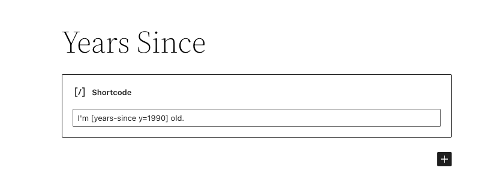
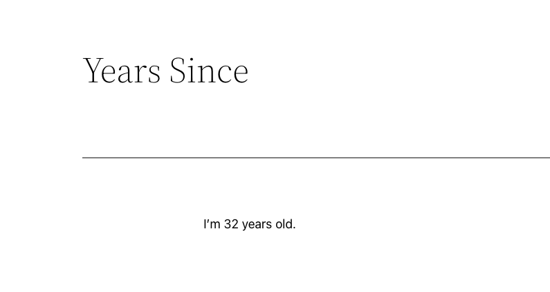

# Years Since

Keep date time related texts relevant. "I have worked for x years." becomes outdated within a year. Years since keeps "x" current in your posts and allow your content to age well. 

## Usage

A year must be provided in your text by the attribute "y" such as ``[years-since y=2012]``.
As an option, Months by referencing "m" and day by using "d". Months and day default to "1" if not added in the shortcode.

For example, on an "About" page text, you might have something like:

> We've worked remotely for ``[years-since y=2012]``, which has allowed the team to spend more time traveling and spending time with family.
Or, if you wanted to update a time span on a particular anniversary, you could do something like:
``I'm [years-since y=1990 m=5 d=16] old.``

## Installation
* Navigate to your plugins admin page.
* Search for "years since" and download the plugin.
* Install using the plugin admin interface.

## Frequently Asked Questions

### Does it work with Gutenberg?
Yes. If you have been using this plugin previously, the new editor used to have breaking changes.
These were managed well by wrapping the old text with new shortcode [years-since-gb] like:

``[years-since-gb]I'm [years-since y=1990 m=5 d=16] old.[/years-since-gb]``.

However, not any more, the issue has since been fixed in the editor.

### Does it work with ClassicPress?
Yes. This will still work even if you revert back to the Classic Editor seamlessly.

## How can I contribute?
You can raise lots of [issues](https://github.com/bahiirwa/years-since/) here and also make some [Pull Requests through github](https://github.com/bahiirwa/years-since/)

## Upgrade Notice

### 1.3.4
- Fix: Restore minus text format for the calculations.
- Add: Translations file build + .pot
- Add: Default attributes for the shortcode.
- New: HTML Default argument paragraph `html` attribute as "p" for the shortcode output.

### 1.3.3
- Fix: Time calculations and messaging.
- Test: WP 6.3.1.
- Test: PHP 8.2.10.

### 1.3.2
- Fix `or` to `||`

### 1.3.1
- Namespace the plugin to avoid PHP conflicts.
- Fix the breaking html when [years-since-gb] is used.
- Test WP version compatibility for 5.6.

### 1.3.0
- Add functionality to allow for days, months, weeks instead of 0 years when time is less than a year.

### 1.2.0
- Add Gutenberg support

### 1.1.0
- Add Gutenberg note to readme.

### 1.0.1
- Translate returned errors.
- Shortcode parameter to suppress "year" and "years" text.

### 1.0.0
- Initial creation.
